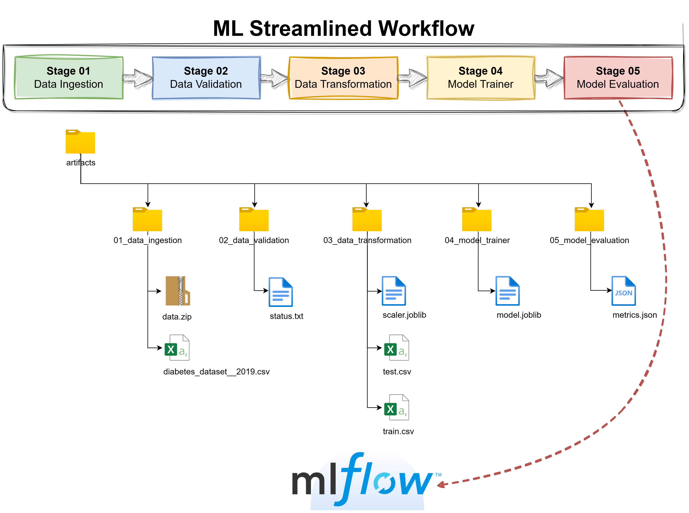
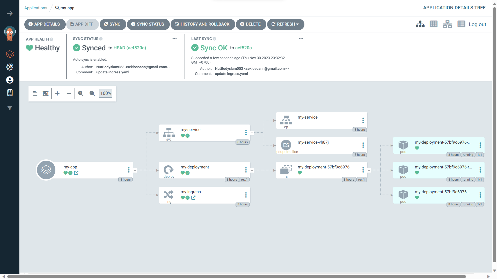

# BD528-software_engineering

## ML Streamlined Workflow

**MLflow**



## Deployment Architecture

**Kubernetes**


### Continuous Integration (CI)

**GitHub Actions**


### Continuous Deployment (CD)

**ArgoCD**



### Web-UI

**Diabetes Checking Web App**


## How to manual run? (FOR USERS)

### STEP 1: Clone repository
```bash
git clone https://github.com/NutBodyslam053/BD528-software_engineering.git
```

### STEP 2: Create conda environment & Activate it
```bash
conda create -n <env_name> python=3.9 -y
conda activate <env_name>
```

### STEP 3: Install dependencies
```bash
pip install -r requirements.txt
```

### STEP 4: Run application
```bash
python app.py
```

### STEP 5: Open web browser
> Diabetes Prediction Web-UI: http://localhost:5000

## How to run with Docker? (FOR USERS)

### STEP 1: Pull image & Run app container
```bash
docker run -dp 5000:5000 nutbodyslam053/bd528:v1
```

### STEP 2: Open web browser
> Diabetes Prediction Web-UI: http://localhost:5000

## Workflows (FOR OWNER)

### 1. Create Github repository & Clone to local repository
```bash
git clone <github_repository_url>
```

### 2. Create template structure & Run to create needed directories
```bash
touch template.py
python template.py
```

### 3. Create virtual environment & Install dependencies
```bash
conda create -p venv python=3.9 -y
conda activate venv/
pip install -r requirements.txt
```

### 4. Initialize logger using constructor
```bash
src/mlProject/__init__.py
```

### 5. Create source code
    5.1 Update config.yaml
    5.2 Update schema.yaml
    5.3 Update params.yaml
    5.4 Update the entity
    5.5 Update the config
    5.6 Update the components
    5.7 Update the pipeline
    5.8 Update the main.py
    5.9 Update the app.py

## API Testing (FOR EVERYONE)

### Predict = 0
Result: คุณไม่มีความเสี่ยงเป็นโรคเบาหวาน

```bash
{
    "age": "50-59",
    "gender": "male",
    "family_diabetes": "no",
    "highbp": "yes",
    "physicallyactive": "one hr or more",
    "bmi": 39,
    "smoking": "no",
    "alcohol": "no",
    "sleep": 8,
    "soundsleep": 6,
    "regularmedicine": "no",
    "junkfood": "occasionally",
    "stress": "sometimes",
    "bplevel": "high",
    "pregancies": 0,
    "pdiabetes": "no",
    "uriationfreq": "not much"
}
```

### Predict = 1
Result: คุณมีความเสี่ยงเป็นโรคเบาหวาน

```bash
{
    "age": "60 or older",
    "gender": "male",
    "family_diabetes": "yes",
    "highbp": "yes",
    "physicallyactive": "more than half an hr",
    "bmi": 27,
    "smoking": "no",
    "alcohol": "no",
    "sleep": 6,
    "soundsleep": 5,
    "regularmedicine": "yes",
    "junkfood": "occasionally",
    "stress": "sometimes",
    "bplevel": "high",
    "pregancies": 0,
    "pdiabetes": "no",
    "uriationfreq": "quite often"
}
```

## Model Training (FOR DEVELOPER)

### Setup system environment variables

**For Unix-like shells (e.g., Bash, macOS Terminal):**
```bash
export MLFLOW_TRACKING_URI=https://dagshub.com/NutBodyslam053/BD528-software_engineering.mlflow
export MLFLOW_TRACKING_USERNAME=NutBodyslam053
export MLFLOW_TRACKING_PASSWORD=b85bafd69d98861fee89f5bf70dc5f62cf41c2e5
```

**For Windows PowerShell:**
```powershell
$env:MLFLOW_TRACKING_URI = "https://dagshub.com/NutBodyslam053/BD528-software_engineering.mlflow"
$env:MLFLOW_TRACKING_USERNAME = "NutBodyslam053"
$env:MLFLOW_TRACKING_PASSWORD = "b85bafd69d98861fee89f5bf70dc5f62cf41c2e5"
```

**For Windows Command Prompt:**
```bash
set MLFLOW_TRACKING_URI=https://dagshub.com/NutBodyslam053/BD528-software_engineering.mlflow
set MLFLOW_TRACKING_USERNAME=NutBodyslam053
set MLFLOW_TRACKING_PASSWORD=b85bafd69d98861fee89f5bf70dc5f62cf41c2e5
```

### Run app container
```bash
docker run -dp 5000:5000 \
    -e MLFLOW_TRACKING_URI=https://dagshub.com/NutBodyslam053/BD528-software_engineering.mlflow \
    -e MLFLOW_TRACKING_USERNAME=NutBodyslam053 \
    -e MLFLOW_TRACKING_PASSWORD=b85bafd69d98861fee89f5bf70dc5f62cf41c2e5 \
    nutbodyslam053/bd528:v1
```

> MLflow tracking remote: https://dagshub.com/NutBodyslam053/BD528-software_engineering.mlflow

## Project Demo

<p>
     
</p>

[](https://www.youtube.com/watch?v=er_mWfr-YDA)

### Witchakorn Wanasanwongkot
[@witchakornwanasanwongkot9657](https://www.youtube.com/@witchakornwanasanwongkot9657)